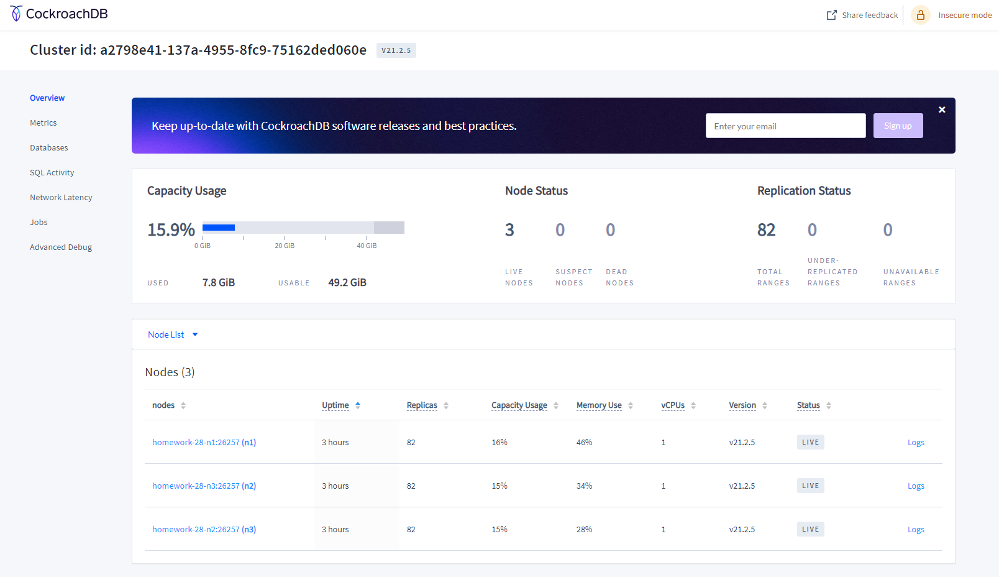
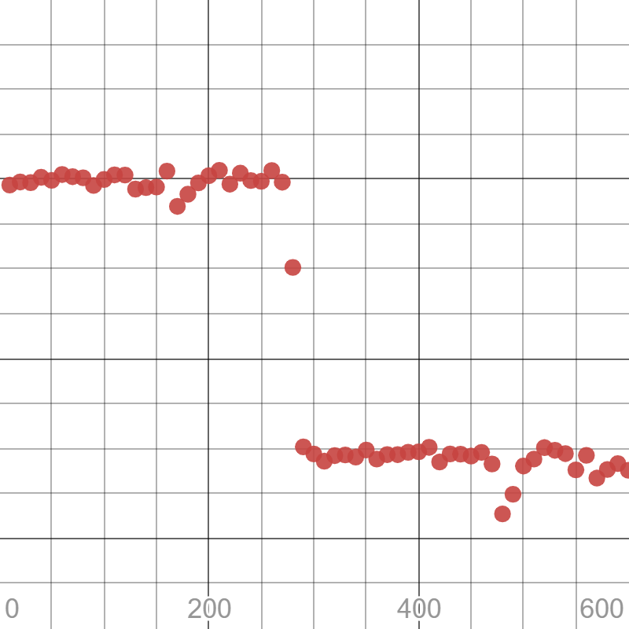

1 вариант:
Развернуть CockroachDB в GKE или GCE
Потесировать dataset с чикагскими такси 
Или залить 10Гб данных и протестировать скорость запросов в сравнении с 1 инстансом PostgreSQL
Описать что и как делали и с какими проблемами столкнулись 

Создадим 3 ноды в GCE, ипортируем около 10ГБ с помощью pgbench и посмотрим время.

gcloud compute instances create --boot-disk-size=20gb homework-28-n1 homework-28-n2 homework-28-n3 --zone=us-central1-c

curl https://binaries.cockroachdb.com/cockroach-v21.2.5.linux-amd64.tgz | tar -xz
sudo cp -i cockroach-v21.2.5.linux-amd64/cockroach /usr/local/bin/
sudo mkdir -p /usr/local/lib/cockroach
sudo cp -i cockroach-v21.2.5.linux-amd64/lib/libgeos*.so /usr/local/lib/cockroach/

cockroach start \
--insecure \
--advertise-addr=homework-28-n1 \
--join=homework-28-n1,homework-28-n2,homework-28-n3 \
--cache=.25 \
--max-sql-memory=.25 \
--background

cockroach start \
--insecure \
--advertise-addr=homework-28-n2 \
--join=homework-28-n1,homework-28-n2,homework-28-n3 \
--cache=.25 \
--max-sql-memory=.25 \
--background

cockroach start \
--insecure \
--advertise-addr=homework-28-n3 \
--join=homework-28-n1,homework-28-n2,homework-28-n3 \
--cache=.25 \
--max-sql-memory=.25 \
--background

cockroach init --insecure --host=homework-28-n1
Cluster successfully initialized

slava@homework-28-n1:~$ cockroach sql --insecure --host=homework-28-n2
root@homework-28-n2:26257/defaultdb> show databases;
  database_name | owner | primary_region | regions | survival_goal
----------------+-------+----------------+---------+----------------
  defaultdb     | root  | NULL           | {}      | NULL
  postgres      | root  | NULL           | {}      | NULL
  system        | node  | NULL           | {}      | NULL
(3 rows)

slava@homework-28-n1:~$ cockroach node status --insecure
  id |       address        |     sql_address      |  build  |         started_at         |         updated_at         | locality | is_available | is_live
-----+----------------------+----------------------+---------+----------------------------+----------------------------+----------+--------------+----------
   1 | homework-28-n1:26257 | homework-28-n1:26257 | v21.2.5 | 2022-02-10 10:44:06.344027 | 2022-02-10 11:02:24.368872 |          | true         | true
   2 | homework-28-n3:26257 | homework-28-n3:26257 | v21.2.5 | 2022-02-10 10:44:07.439744 | 2022-02-10 11:02:25.455991 |          | true         | true
   3 | homework-28-n2:26257 | homework-28-n2:26257 | v21.2.5 | 2022-02-10 10:44:08.134219 | 2022-02-10 11:02:21.654092 |          | true         | true
(3 rows)

pgbench -i --init-steps=tg --scale=800 -p 26257 -U root -h localhost -d postgres
NOTICE:  storage parameter "fillfactor" is ignored
NOTICE:  storage parameter "fillfactor" is ignored
NOTICE:  storage parameter "fillfactor" is ignored
generating data...
100000 of 80000000 tuples (0%) done (elapsed 0.03 s, remaining 27.14 s)
200000 of 80000000 tuples (0%) done (elapsed 0.07 s, remaining 28.87 s)
300000 of 80000000 tuples (0%) done (elapsed 0.12 s, remaining 32.24 s)
400000 of 80000000 tuples (0%) done (elapsed 3.78 s, remaining 751.72 s)
500000 of 80000000 tuples (0%) done (elapsed 6.76 s, remaining 1075.41 s)
600000 of 80000000 tuples (0%) done (elapsed 9.94 s, remaining 1315.61 s)
.....
79700000 of 80000000 tuples (99%) done (elapsed 6064.88 s, remaining 22.83 s)
79800000 of 80000000 tuples (99%) done (elapsed 6077.08 s, remaining 15.23 s)
79900000 of 80000000 tuples (99%) done (elapsed 6082.48 s, remaining 7.61 s)
80000000 of 80000000 tuples (100%) done (elapsed 6092.54 s, remaining 0.00 s)

Ушло около 100 минут. Заливка таких же данных на postgres - около 5 минут.

   

