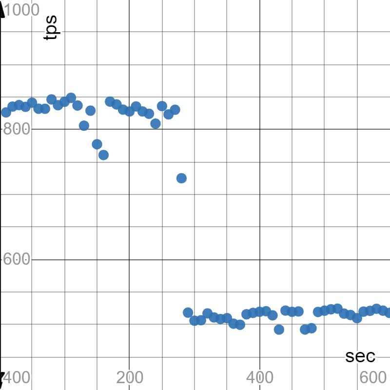

Домашнее задание
Настройка autovacuum с учетом оптимальной производительности

Цель:
запустить нагрузочный тест pgbench
настроить параметры autovacuum для достижения максимального уровня устойчивой производительности
создать GCE инстанс типа e2-medium и standard disk 10GB
установить на него PostgreSQL 13 с дефолтными настройками
применить параметры настройки PostgreSQL из прикрепленного к материалам занятия файла

    slava@homework-6:~$ cat << EOF | sudo tee /etc/postgresql/13/main/postgresql-homework-6-cluster.conf
    max_connections = 40
    shared_buffers = 1GB
    effective_cache_size = 3GB
    maintenance_work_mem = 512MB
    checkpoint_completion_target = 0.9
    wal_buffers = 16MB
    default_statistics_target = 500
    random_page_cost = 4
    effective_io_concurrency = 2
    work_mem = 6553kB
    min_wal_size = 4GB
    max_wal_size = 16GB
    EOF

    slava@homework-6:~$ echo "include = /etc/postgresql/13/main/postgresql-homework-6-cluster.conf" | sudo tee -a /etc/postgresql/13/main/postgresql.conf
    
    
зайти под пользователем postgres - sudo su postgres
выполнить pgbench -i postgres
запустить pgbench -c8 -P 10 -T 600 -U postgres postgres
дать отработать до конца

    number of transactions actually processed: 395156
    latency average = 12.133 ms
    latency stddev = 16.366 ms
    tps = 658.560816 (including connections establishing)
    tps = 658.564147 (excluding connections establishing)

дальше настроить autovacuum максимально эффективно

    slava@homework-6:~$ cat << EOF | sudo tee /etc/postgresql/13/main/postgresql-homework-6-autovacuum.conf
    > log_autovacuum_min_duration = 0
    > autovacuum_max_workers = 10
    > autovacuum_naptime = 15s
    > autovacuum_vacuum_threshold = 25
    tovacuum> autovacuum_vacuum_scale_factor = 0.1
    > autovacuum_vacuum_cost_delay = 10
    > autovacuum_vacuum_cost_limit = 1000
    > EOF
    
     echo "include = /etc/postgresql/13/main/postgresql-homework-6-autovacuum.conf" | sudo tee -a /etc/postgresql/13/main/postgresql.conf

построить график по получившимся значениям
так чтобы получить максимально ровное значение tps

Пока что ничего не получается:

   

  
